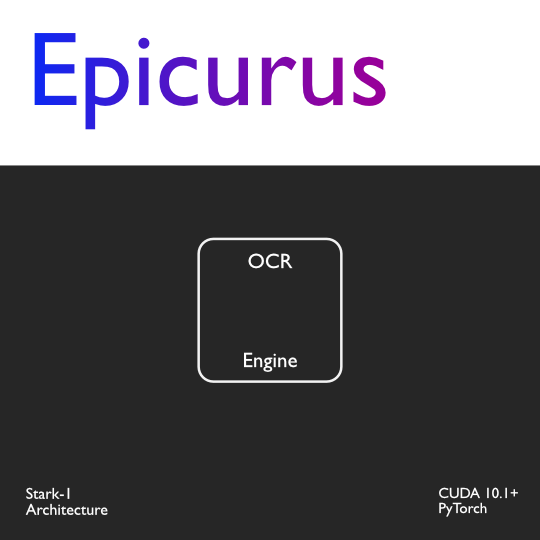

    

# Epicurus
#### Branch: main v1.0.0

### Description
Epicurus is a Deep OCR Engine which can read English characters, words and texts in documents, real world scenes.
It's a light weight model aimed at faster output and general purpose applications.

### Text Detection Architecture 
East Text detection

### Text Recognition Architecture
CRNN + CTC

